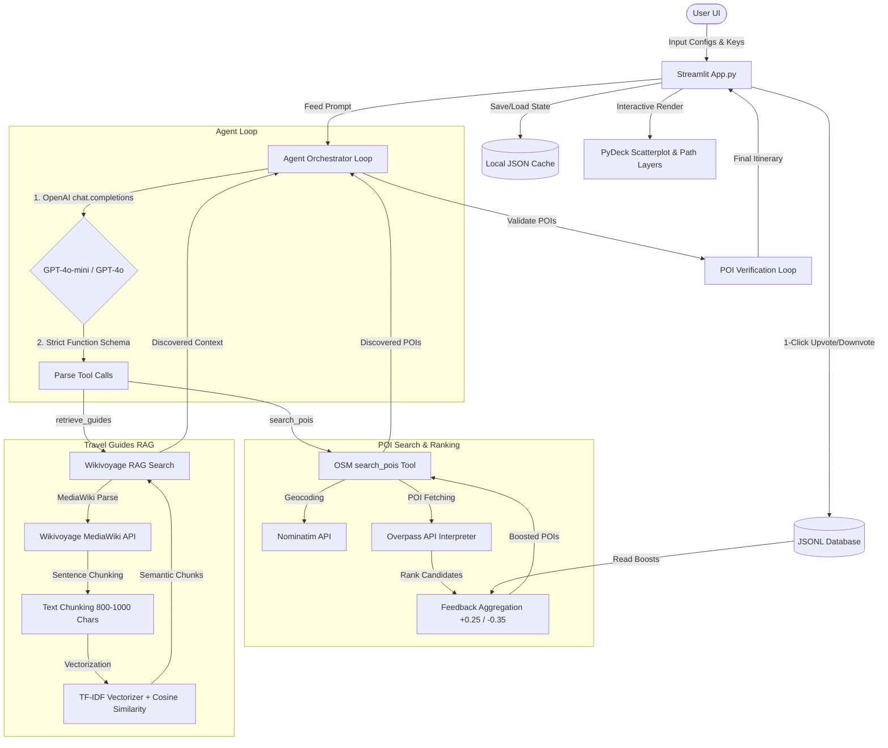

# Wander AI - Autonomous Trip & Itinerary Planner

Wander AI is a production-grade, autonomous travel planning application that goes beyond simple chatbots to showcase real-world AI engineering, agentic workflows, dynamic map visualization, and persistent feedback-driven optimization. 

Built using Streamlit and OpenAI's strict tool calling, the agent connects live to OpenStreetMap's geocoding and Points of Interest (POI) databases, integrates retrieval-augmented generation (RAG) over Wikivoyage travel guides, visualizes itineraries on interactive PyDeck maps, and refines them via natural language.

---

## Architecture Diagram

The diagram below visualizes the data flow, API integrations, and the feedback optimization loop:



---

## Core Features

1. **Agent Architecture with Strict Function Calling**:
   - OpenAI Responses API structured with `"strict": true` schemas to guarantee zero hallucinated parameters.
   - Max loop step limits to prevent runaways, and request-level timeouts (30.0s).
   - Trace log viewer displaying exact agent execution paths, timings, and tool arguments.
   
2. **Real-Time Data Integration**:
   - Geocodes location names using OpenStreetMap's Nominatim API with compliant contact headers.
   - Fetches live POIs from the Overpass API, filtered dynamically using custom tag maps.
   - Rate limit protection utilizing exponential backoff retry loops.
   - Broad fallback query execution when initial interest searches yield 0 results.

3. **Wikivoyage RAG Search System**:
   - Queries MediaWiki APIs to retrieve destination guide articles.
   - Parses, cleans HTML tags, and chunks contents using sentence-boundary sliding windows (800-1000 characters).
   - Indexes text and ranks semantic search results using scikit-learn's `TfidfVectorizer` (optimized with custom travel-specific stop words to eliminate airport/transport noise).

4. **Interactive Map Visualization**:
   - Integrates PyDeck rendering Scatterplot layers for POI markers (colored by day) and Path layers for chronological daily routes.
   - Dropdown selectors to isolate daily schedules or view the entire trip map.
   - Adaptive viewports calculating center coordinates and auto-scaled zoom levels.
   - Rich hover tooltips revealing POI name, category, and sequence stop.

5. **Itinerary Refinement & Splicing**:
   - Refines plans using natural language prompts (e.g. "Add outdoor parks to Day 1").
   - Supports full itinerary edits or specific day regeneration.
   - Employs a Python day-level splicing compiler that guarantees non-regenerated days remain 100% identical.

6. **Feedback Loop Database**:
   - Plain-text Upvote (`+`) and Downvote (`-`) inputs next to each POI card.
   - Records feedback events with timestamps and locations to `poi_feedback.jsonl`.
   - Aggregates boost scores (`+0.25` for upvotes, `-0.35` for downvotes) and applies them dynamically to sort candidate POIs in `search_pois` before the agent compiles the plan.

7. **Security & Connection Diagnostics**:
   - Sidebar tab running diagnostic test suites for geocoding, Overpass interpreter speeds, and RAG chunking.
   - Safe JSON loaders recovering and deleting corrupted state caches to prevent application crashes.

---

## Setup & Running Locally

### 1. Requirements
Ensure you have Python 3.10+ installed. Install the dependencies listed in `requirements.txt`:
```bash
pip install -r requirements.txt
```

*Required packages include:* `streamlit`, `openai`, `pydeck`, `requests`, `scikit-learn`, `pandas`, `jinja2`.

### 2. Run the Server
Launch the Streamlit app locally:
```bash
streamlit run app.py
```
The server will start and bind to `http://localhost:8501`.

### 3. Usage & Diagnostics
- **Diagnostic key**: If you don't have an active OpenAI API key with credit, enter the word **`mock`** into the OpenAI API Key sidebar field to unlock all planner features. Click **Generate Travel Itinerary** to populate the interface with deterministic mock datasets for testing all refinement, PyDeck mapping, and feedback voting mechanics.
- **Diagnostics Tab**: Check the **API Diagnostics & Connection Tests** tab to test OSM Nominatim, Overpass API speeds, and Wikivoyage page downloads.

---

## API Requirements & Rate Limits

Compliance with API provider rules is vital to avoid IP bans:

1. **OSM Nominatim API**:
   - **Requirement**: Compliant `User-Agent` header disclosing contact details.
   - **Rate Limit**: Strictly limited to a maximum of 1 request per second. The application handles this by caching geocodes for 24 hours (`@st.cache_data`) and running 3-attempt exponential backoff loops if HTTP 429 is encountered.

2. **OSM Overpass API**:
   - **Rate Limit**: Interpreters are shared community resources. Excessive parallel queries will trigger rate limiting. Queries are cached locally for 1 hour to reduce server load.

3. **Wikivoyage API**:
   - Uses Wikimedia foundation guidelines. Request headers specify compliance signatures, and chunk results are cached using Streamlit resource hashes.

4. **OpenAI API**:
   - Requires valid API Key and sufficient account credits. Completion calls enforce a 30-second request timeout to handle API hangs.

---

## Concurrency & Session Testing

Streamlit handles concurrent users natively by starting a fresh session thread for each browser connection. 
- **Session Isolation**: Each user session has its own isolated `st.session_state` dict containing their current inputs, map state, and generated itinerary. Toggling or editing inputs in one tab has zero impact on other active connections.
- **Feedback Concurrency**: User feedback writes are appended to `data/feedback/poi_feedback.jsonl`. Since Python handles file appends atomically at the OS level, concurrent upvotes from multiple users are logged safely without locking or corrupting the database.
- **Disk Cache Isolation**: Session state files saved to disk are scoped by destination (e.g. `itinerary_rome.json`), allowing multiple users to load or restore cached trips for different destinations.
