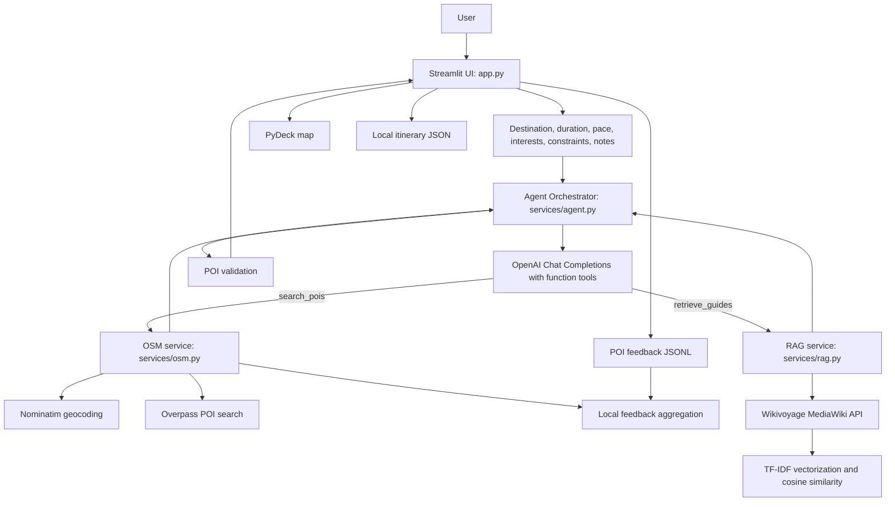

# Wander AI Project Report

## 1. Executive Summary

Wander AI is an AI-assisted travel itinerary planner built as a Streamlit application. It accepts a destination, trip duration, travel pace, interests, constraints, and additional requests, then uses an OpenAI tool-calling agent to assemble a day-by-day itinerary.

The application grounds recommendations with live external data rather than relying only on model memory:

- OpenStreetMap Nominatim provides destination geocoding.
- OpenStreetMap Overpass provides points of interest (POIs).
- Wikivoyage provides travel-guide context through a retrieval-augmented generation (RAG) pipeline.
- A local JSONL feedback store changes POI ranking over time.
- Python-side validation checks whether itinerary POIs were returned by the search tools.

The project also provides interactive maps, itinerary refinement, local persistence, diagnostics, and JSON export.

## 2. Project Purpose

The purpose of Wander AI is to demonstrate a practical agentic travel-planning workflow with four goals:

1. Personalize itineraries using user preferences and trip constraints.
2. Reduce fabricated attractions by requiring the agent to search for real POIs.
3. Add destination-specific context through Wikivoyage retrieval.
4. Improve future POI ranking using explicit user feedback.

The application is intended as a capstone or prototype system demonstrating how a language model can coordinate external tools and produce a user-facing travel product.

## 3. Main User Workflow

1. The user enters an OpenAI API key or selects the documented `mock` mode.
2. The user enters a destination, duration, pace, interests, constraints, and optional notes.
3. The agent receives the request through `run_itinerary_agent`.
4. The model can call two tools:
   - `search_pois` for real locations from OpenStreetMap.
   - `retrieve_guides` for relevant Wikivoyage context.
5. Tool responses are accumulated in agent state.
6. The model compiles a day-by-day itinerary.
7. Python validates POI references against discovered POIs.
8. Streamlit renders the itinerary, map, POI references, citations, and feedback controls.
9. The result is saved under `data/itineraries/` and can be refined later.

## 4. Architecture



### 4.1 Presentation Layer

`app.py` is the Streamlit application layer. It is responsible for:

- API-key and model selection controls.
- Trip configuration inputs.
- Mock-mode execution.
- Agent execution and refinement buttons.
- Itinerary rendering.
- PyDeck map rendering.
- POI verification displays.
- Source citation displays.
- Upvote/downvote feedback controls.
- JSON download/export.
- Diagnostic and RAG search tabs.

### 4.2 Agent Orchestration Layer

`services/agent.py` coordinates OpenAI and the local tools.

The agent maintains two accumulated states:

- `discovered_pois`: places returned from OpenStreetMap.
- `retrieved_chunks`: Wikivoyage context returned by the RAG service.

The tool schemas are strict. `search_pois` requires `city_name`, `interests`, `radius`, and `limit`. `retrieve_guides` requires `city_name`, `query`, and `top_k`. Each schema sets `additionalProperties` to `False` and `strict` to `True`. This validates the structure of model-generated tool arguments; it does not prove that the model's final prose is factually correct.

The orchestration loop sends the initial prompts, receives model tool calls, parses their JSON arguments, executes the selected Python function, adds the result back to the conversation, and repeats until the model stops requesting tools or the step limit is reached. A final compilation request formats the gathered data into a day-by-day itinerary. The default maximum is five loop steps; fast mode reduces it to two. OpenAI calls use a 30-second timeout.

### 4.3 POI and External Data Layer

`services/osm.py` implements the POI service:

- Nominatim geocodes the city name.
- Overpass QL searches tags associated with selected interests.
- Supported categories are food, history, art, culture, outdoors, shopping, and entertainment.
- Unnamed POIs or results without usable coordinates are discarded.
- Results are normalized into ID, name, category, latitude, longitude, and URL fields.
- Feedback boosts affect result ordering.
- A broader fallback search runs when a targeted query returns no elements.

Geocoding is cached for 24 hours and Overpass query results for one hour. HTTP failures and rate limits use retries with increasing waits.

### 4.4 Retrieval-Augmented Generation Layer

`services/rag.py` resolves a Wikivoyage title, fetches MediaWiki HTML, removes markup, splits content into sentence-based chunks of approximately 900 characters with overlap, removes very short chunks, and fits a scikit-learn TF-IDF vectorizer. The user query is transformed into the same vector space and compared using cosine similarity. The top positive matches are returned with source, text, chunk ID, and score. The index and search results use Streamlit caching.

### 4.5 Validation and Grounding

`validate_itinerary_pois` performs a case-insensitive substring check to identify discovered POI names mentioned in the final itinerary. The UI displays verified POIs separately from discovered but unused POIs. This is a useful grounding signal, but it is not a complete hallucination detector: it cannot identify every invented place absent from the tool results, and substring matching can produce false matches.

### 4.6 Persistence and Feedback Loop

Generated itinerary state is saved as JSON in `data/itineraries/`. POI feedback is appended as JSON Lines in `data/feedback/poi_feedback.jsonl`.

Feedback scoring is deterministic:

- Upvote: `+0.25`
- Downvote: `-0.35`
- Net score: `(upvotes * 0.25) - (downvotes * 0.35)`

Scores are aggregated per city and POI and used to sort future POI results. This is explainable preference ranking, not a trained recommendation model.

### 4.7 Visualization Layer

The application maps verified POIs to day and stop order by parsing day headings and searching for POI names. PyDeck renders scatterplot markers, chronological path layers, day filters, dark/light map styles, and hover details containing name, category, day, and stop number. The map center and zoom are calculated from the geographic span of selected POIs.

## 5. Technology Stack

| Technology | Use in the project |
|---|---|
| Python 3.10+ | Primary implementation language. |
| Streamlit | Reactive web UI, caching, session state, diagnostics, and rendering. |
| OpenAI Python SDK | Chat Completions API and function/tool calling. |
| GPT-4o-mini or GPT-4o | Itinerary reasoning and tool selection. |
| Requests | HTTP communication with external APIs. |
| OpenStreetMap Nominatim | Destination geocoding. |
| OpenStreetMap Overpass API | POI discovery with Overpass QL. |
| Wikivoyage MediaWiki API | Destination travel-guide retrieval. |
| scikit-learn | TF-IDF vectorization and cosine similarity. |
| NumPy | Similarity result sorting in the RAG layer. |
| Pandas | POI/map data preparation and feedback statistics. |
| PyDeck | Interactive geospatial visualization. |
| JSON and JSONL | Local itinerary and feedback persistence. |
| Mermaid | Architecture documentation. |

Declared direct dependencies are in `requirements.txt`: `streamlit`, `openai`, `pydeck`, `requests`, `scikit-learn`, and `pandas`. NumPy is used by the RAG service as a transitive dependency of the current scikit-learn environment.

## 6. Directory Structure

```text
Wander AI/
├── app.py                              # Streamlit application and UI workflow
├── README.md                           # Project overview and setup
├── report.md                           # Detailed technical project report
├── requirements.txt                    # Python dependencies
├── services/
│   ├── agent.py                        # Agent loop, tools, validation, refinement
│   ├── osm.py                          # Geocoding, POI search, feedback ranking
│   └── rag.py                          # Wikivoyage fetching and TF-IDF retrieval
└── data/
    ├── feedback/
    │   └── poi_feedback.jsonl         # Append-only POI feedback events
    └── itineraries/
        ├── itinerary_rome_italy.json  # Saved itinerary/error artifact
        └── itinerary_rome_italyro.json # Additional test/mock artifact
```

The app creates `data/feedback/` and `data/itineraries/` at startup when they do not exist.

## 7. Evaluation Strategy

The project supports functional checks, deterministic mock execution, source-grounding checks, API diagnostics, and runtime instrumentation. There is currently no automated pytest suite or statistically controlled benchmark in the repository. Metrics below are therefore evaluation mechanisms and observed signals, not a formal accuracy study.

### 7.1 Functional Evaluation

| Scenario | Evaluation procedure | Success criterion |
|---|---|---|
| Input validation | Submit blank, short, numeric, or invalid destination/API-key inputs. | The UI rejects invalid input before agent execution. |
| Mock generation | Enter `mock` as the API key and generate. | Deterministic itinerary, POI state, trace, and citations appear without OpenAI. |
| Live generation | Use a valid key and generate a trip. | The model calls tools and produces a formatted itinerary. |
| POI grounding | Compare itinerary names with `discovered_pois`. | Mentioned places are verified; unused results are identified. |
| Refinement | Apply full-plan and single-day changes. | Requested scope changes and untouched days remain preserved. |
| Map rendering | Generate an itinerary with verified POIs. | Markers, filters, paths, tooltips, center, and zoom render. |
| Feedback loop | Upvote/downvote and search again. | Events are stored and affect ranking scores. |
| RAG search | Query a destination and topic. | Relevant positive-score chunks are displayed. |
| Persistence | Generate and reload a destination. | Saved JSON restores planner state. |

### 7.2 Quality and Grounding Metrics

The application exposes:

- **Verified POI count:** discovered POIs mentioned in the itinerary.
- **Unused POI count:** discovered POIs not selected in the final text.
- **Grounding rate:** `verified_pois / discovered_pois`, when the denominator is non-zero.
- **RAG retrieval count:** chunks with similarity greater than zero.
- **RAG similarity score:** cosine similarity returned for each chunk.
- **Feedback net score:** `(upvotes * 0.25) - (downvotes * 0.35)`.
- **Day preservation:** comparison of non-target day blocks before and after refinement.

The code exposes these signals during use, but no averages, distributions, confidence intervals, or human quality labels have been collected in the repository.

### 7.3 Latency Evaluation

Latency is instrumented but not comprehensively benchmarked. The agent stores elapsed timestamps in trace messages for initialization, each OpenAI loop step, tool requests, tool result counts, and final compilation. A complete run can be estimated from the final trace timestamp, but the app does not automatically calculate p50, p95, minimum, maximum, or per-service averages.

Configured limits are not measured latency results:

- Nominatim request timeout: 10 seconds.
- Wikivoyage request timeout: 10 to 15 seconds depending on the operation.
- Overpass request timeout: 30 seconds.
- OpenAI completion timeout: 30 seconds per request.
- Nominatim and Overpass: up to three attempts with increasing waits.

For rigorous evaluation, run a fixed matrix across destinations and record total latency, per-tool latency, retry waits, error rate, and timeout rate. At least 30 runs per scenario are recommended for useful percentile estimates. Scenarios should include cached versus uncached requests, one versus several interests, successful calls versus retry cases, and short versus multi-day itineraries.

### 7.4 Reliability and Error Evaluation

Controlled failure paths include invalid API-key rejection, structured OpenAI errors, HTTP retries, missing geocoding results, broad fallback POI searches, corrupt JSON cleanup, missing feedback handling, and skipping malformed feedback lines. Future reliability reporting should include success rate, retry recovery rate, timeout rate, and malformed-response rate over a fixed run count.

### 7.5 Current Observed Artifacts

The feedback file contains five upvote events for the `rome, italyro` test destination. Under the implemented scoring rule, the recorded events contribute:

- Colosseum: `3 * 0.25 = +0.75`.
- Da Enzo Al 29: `+0.25`.
- Roman Forum: `+0.25`.

The saved `itinerary_rome_italy.json` contains an OpenAI quota error. This demonstrates persisted error handling, not normal live-generation latency or quality.

## 8. Weather and Environmental Conditions

Weather is not currently integrated. There is no forecast API, weather input field, weather tool schema, or weather-based scheduling logic. Users can mention weather manually in additional notes, but the condition is not verified.

A future implementation should add a forecast provider, structured temperature/precipitation/wind fields, indoor/outdoor substitution rules, forecast timestamps, and labeled evaluation scenarios for rain, high heat, and clear weather.

## 9. Security, Privacy, and Operations

- API keys are entered through Streamlit and kept in active session state.
- External APIs use a custom User-Agent header.
- External requests use timeouts and retry handling.
- Itineraries and feedback are stored locally as plain JSON/JSONL.
- There is no authentication, authorization, encryption, retention policy, or multi-user database isolation.
- The default OSM User-Agent contains a placeholder contact address and should be replaced before production use.
- Caching reduces repeated calls but does not replace provider-specific rate-limit compliance.

## 10. Strengths

1. External POI and guide retrieval grounds itinerary generation.
2. Strict schemas reduce malformed tool arguments and unknown parameters.
3. POI validation makes grounding visible.
4. Mock mode supports deterministic UI testing without OpenAI credits.
5. Single-day refinement preserves untouched days through deterministic splicing.
6. Caching, retries, fallback queries, and structured errors improve resilience.
7. Feedback ranking is simple and explainable.

## 11. Limitations

1. There is no automated test suite or repeatable benchmark harness.
2. POI validation cannot detect every hallucination and may have substring false matches.
3. Weather, traffic, transit routing, opening hours, ticket availability, and live operating status are not integrated.
4. POI ranking does not optimize distance, geographic clustering, or feasibility.
5. RAG uses TF-IDF lexical similarity rather than embeddings or a vector database.
6. Local JSON/JSONL persistence is not suitable for concurrent production workloads.
7. Latency is traced but not aggregated into formal benchmark metrics.
8. Prose itineraries are not formally checked for time or travel feasibility.
9. Some README wording refers to the Responses API, while the implementation uses `client.chat.completions.create`; documentation should be made consistent.

## 12. Future Enhancements

### Near-Term

- Add unit tests for POI parsing, category mapping, feedback aggregation, validation, and day splicing.
- Add an automated benchmark command for latency, tool calls, errors, and grounding.
- Add structured logs with run IDs and per-service timings.
- Replace placeholder OSM contact information.
- Add numeric schema constraints for radius, limit, and top-k.

### Product

- Integrate weather forecasts and weather-aware substitutions.
- Add opening hours, holidays, ticket availability, and reservations.
- Add walking, driving, and public-transit travel times.
- Cluster POIs geographically.
- Add budget, mobility, accessibility, and dietary fields as structured inputs.
- Support multi-city trips and calendar export.

### AI and Data

- Replace TF-IDF with embedding-based retrieval and a persistent vector store.
- Rerank by relevance, preference, feedback, distance, and time feasibility.
- Use typed itinerary output with activities, coordinates, durations, and reasons.
- Validate available hours and travel times per day.
- Add labeled evaluation datasets for destinations, interests, and weather scenarios.
- Compare model versions with identical prompts and test cases.

### Production

- Move persistence to a transactional database.
- Add authentication and per-user isolation.
- Add secret management.
- Add observability dashboards for latency, failures, cache hits, and tool usage.
- Coordinate rate limits across application instances.

## 13. Recommended Evaluation Plan

1. Create a fixed test set of destinations, durations, interests, constraints, and refinement requests.
2. Run every case in mock mode to test deterministic UI and persistence behavior.
3. Run live cases with fixed model, temperature, and tool limits.
4. Record total and per-tool latency, OpenAI call count, retries, and error types.
5. Measure POI grounding rate and manually label recommendation appropriateness.
6. Measure retrieval quality with human relevance labels or precision at k.
7. Compare non-target day blocks byte-for-byte after single-day refinement.
8. Simulate invalid keys, empty responses, HTTP 429s, timeouts, malformed JSON, and missing files.
9. Report averages and percentiles rather than isolated timings.
10. Repeat after each model, prompt, retrieval, or ranking change.

## 14. Conclusion

Wander AI demonstrates a tool-using travel-planning agent with external grounding, RAG context, interactive visualization, feedback-based ranking, and itinerary refinement. Its strongest current evidence is functional: deterministic mock execution, visible traces, POI verification, API diagnostics, and error handling are implemented. Its largest evaluation gap is the absence of a repeatable benchmark suite with collected latency distributions, quality labels, and failure-rate reports.

The most valuable next engineering step is an automated evaluation harness with structured observability. That would turn the existing trace and UI signals into defensible measurements for latency, grounding, retrieval quality, reliability, and future weather-aware planning.